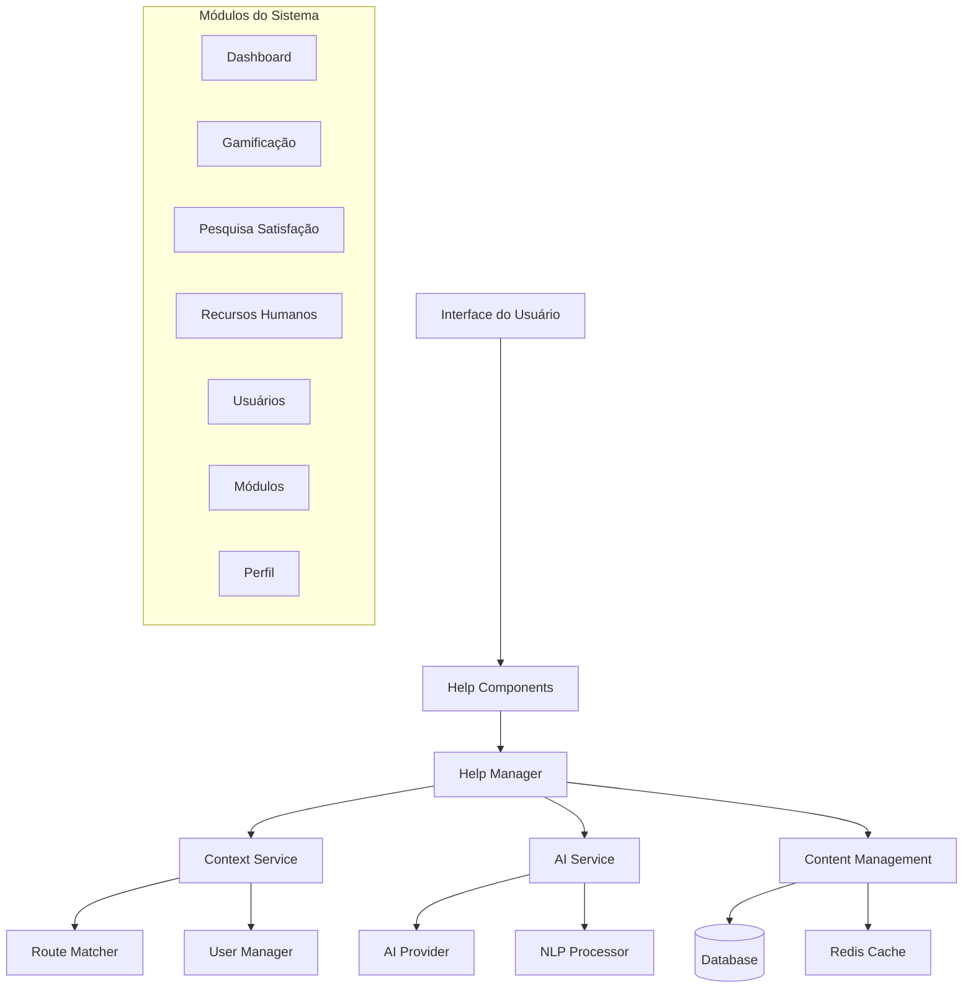
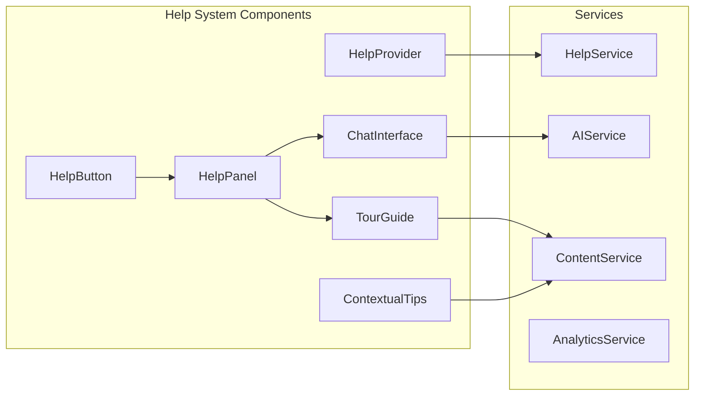

# Design Document

## Overview

A plataforma de ajuda com IA será implementada como um sistema modular e extensível que fornece suporte contextual inteligente para todos os módulos do sistema de gamificação. A arquitetura combina componentes React reutilizáveis, serviços de IA, e um sistema de gerenciamento de conteúdo flexível para criar uma experiência de ajuda personalizada e intuitiva.

## Architecture

### High-Level Architecture



### Component Architecture



## Components and Interfaces

### Core Components

#### 1. HelpProvider
```typescript
interface HelpProviderProps {
  children: React.ReactNode;
  moduleContext: ModuleContext;
  userRole: UserRole;
}

interface ModuleContext {
  module: 'dashboard' | 'gamificacao' | 'pesquisa' | 'rh' | 'usuarios' | 'modulos' | 'perfil';
  subModule?: string;
  pageData?: Record<string, any>;
}
```

#### 2. HelpButton
```typescript
interface HelpButtonProps {
  position?: 'fixed' | 'inline';
  variant?: 'icon' | 'text' | 'floating';
  size?: 'sm' | 'md' | 'lg';
  customTrigger?: React.ReactNode;
}
```

#### 3. HelpPanel
```typescript
interface HelpPanelProps {
  isOpen: boolean;
  onClose: () => void;
  context: ModuleContext;
  initialTab?: 'chat' | 'guide' | 'docs' | 'shortcuts';
}
```

#### 4. ChatInterface
```typescript
interface ChatInterfaceProps {
  context: ModuleContext;
  onMessageSent: (message: string) => void;
  onFeedback: (messageId: string, rating: number) => void;
}

interface ChatMessage {
  id: string;
  type: 'user' | 'ai' | 'system';
  content: string;
  timestamp: Date;
  context?: ModuleContext;
  actions?: ChatAction[];
}

interface ChatAction {
  type: 'navigate' | 'highlight' | 'tour';
  label: string;
  payload: any;
}
```

#### 5. TourGuide
```typescript
interface TourGuideProps {
  tourId: string;
  steps: TourStep[];
  onComplete: () => void;
  onSkip: () => void;
}

interface TourStep {
  id: string;
  target: string;
  title: string;
  content: string;
  position: 'top' | 'bottom' | 'left' | 'right';
  action?: 'click' | 'hover' | 'focus';
}
```

### Services

#### 1. HelpService
```typescript
class HelpService {
  async getContextualHelp(context: ModuleContext, userRole: UserRole): Promise<HelpContent>
  async searchHelp(query: string, context: ModuleContext): Promise<SearchResult[]>
  async recordInteraction(interaction: HelpInteraction): Promise<void>
  async getUserPreferences(userId: string): Promise<HelpPreferences>
  async updateUserPreferences(userId: string, preferences: HelpPreferences): Promise<void>
}
```

#### 2. AIService
```typescript
class AIService {
  async processQuery(query: string, context: ModuleContext): Promise<AIResponse>
  async generateContextualSuggestions(context: ModuleContext): Promise<Suggestion[]>
  async improveResponse(messageId: string, feedback: Feedback): Promise<void>
}
```

#### 3. ContentService
```typescript
class ContentService {
  async getContent(contentId: string, userRole: UserRole): Promise<HelpContent>
  async getTour(tourId: string): Promise<Tour>
  async getShortcuts(context: ModuleContext): Promise<Shortcut[]>
  async updateContent(contentId: string, content: HelpContent): Promise<void>
}
```

## Data Models

### Database Schema

```sql
-- Tabela principal de conteúdo de ajuda
CREATE TABLE help_contents (
  id UUID PRIMARY KEY DEFAULT gen_random_uuid(),
  module VARCHAR(50) NOT NULL,
  sub_module VARCHAR(50),
  content_type VARCHAR(20) NOT NULL, -- 'text', 'tour', 'faq', 'shortcut'
  title VARCHAR(255) NOT NULL,
  content JSONB NOT NULL,
  target_roles VARCHAR(100)[], -- ['ADMIN', 'USER', etc.]
  is_active BOOLEAN DEFAULT true,
  created_at TIMESTAMP DEFAULT NOW(),
  updated_at TIMESTAMP DEFAULT NOW()
);

-- Tabela de tours guiados
CREATE TABLE help_tours (
  id UUID PRIMARY KEY DEFAULT gen_random_uuid(),
  tour_id VARCHAR(100) UNIQUE NOT NULL,
  module VARCHAR(50) NOT NULL,
  title VARCHAR(255) NOT NULL,
  description TEXT,
  steps JSONB NOT NULL,
  target_roles VARCHAR(100)[],
  is_active BOOLEAN DEFAULT true,
  created_at TIMESTAMP DEFAULT NOW()
);

-- Tabela de interações do usuário
CREATE TABLE help_interactions (
  id UUID PRIMARY KEY DEFAULT gen_random_uuid(),
  user_id UUID REFERENCES users(id),
  session_id VARCHAR(100),
  interaction_type VARCHAR(50) NOT NULL, -- 'chat', 'tour', 'content_view'
  module VARCHAR(50) NOT NULL,
  content_id UUID,
  query TEXT,
  response TEXT,
  feedback_rating INTEGER CHECK (feedback_rating >= 1 AND feedback_rating <= 5),
  created_at TIMESTAMP DEFAULT NOW()
);

-- Tabela de preferências do usuário
CREATE TABLE help_preferences (
  id UUID PRIMARY KEY DEFAULT gen_random_uuid(),
  user_id UUID REFERENCES users(id) UNIQUE,
  show_tours BOOLEAN DEFAULT true,
  show_tips BOOLEAN DEFAULT true,
  help_mode VARCHAR(20) DEFAULT 'standard', -- 'standard', 'advanced', 'minimal'
  completed_tours VARCHAR(100)[],
  preferred_language VARCHAR(10) DEFAULT 'pt-BR',
  updated_at TIMESTAMP DEFAULT NOW()
);

-- Tabela de métricas de ajuda
CREATE TABLE help_analytics (
  id UUID PRIMARY KEY DEFAULT gen_random_uuid(),
  date DATE NOT NULL,
  module VARCHAR(50) NOT NULL,
  metric_type VARCHAR(50) NOT NULL, -- 'views', 'queries', 'tours_completed'
  metric_value INTEGER NOT NULL,
  additional_data JSONB
);
```

### TypeScript Interfaces

```typescript
interface HelpContent {
  id: string;
  module: string;
  subModule?: string;
  contentType: 'text' | 'tour' | 'faq' | 'shortcut';
  title: string;
  content: {
    text?: string;
    html?: string;
    steps?: TourStep[];
    shortcuts?: Shortcut[];
  };
  targetRoles: UserRole[];
  isActive: boolean;
}

interface HelpInteraction {
  userId: string;
  sessionId: string;
  interactionType: 'chat' | 'tour' | 'content_view';
  module: string;
  contentId?: string;
  query?: string;
  response?: string;
  feedbackRating?: number;
}

interface HelpPreferences {
  userId: string;
  showTours: boolean;
  showTips: boolean;
  helpMode: 'standard' | 'advanced' | 'minimal';
  completedTours: string[];
  preferredLanguage: string;
}
```

## Error Handling

### Error Types
```typescript
enum HelpErrorType {
  CONTENT_NOT_FOUND = 'CONTENT_NOT_FOUND',
  AI_SERVICE_UNAVAILABLE = 'AI_SERVICE_UNAVAILABLE',
  INVALID_CONTEXT = 'INVALID_CONTEXT',
  PERMISSION_DENIED = 'PERMISSION_DENIED',
  RATE_LIMIT_EXCEEDED = 'RATE_LIMIT_EXCEEDED'
}

class HelpError extends Error {
  constructor(
    public type: HelpErrorType,
    message: string,
    public context?: ModuleContext
  ) {
    super(message);
  }
}
```

### Fallback Strategies
1. **AI Service Failure**: Fallback para conteúdo estático pré-configurado
2. **Content Not Found**: Exibir ajuda genérica do módulo
3. **Network Issues**: Usar cache local e modo offline
4. **Permission Errors**: Redirecionar para conteúdo público

## Testing Strategy

### Unit Tests
- Componentes React com React Testing Library
- Serviços com Jest e mocks
- Utilitários de contexto e formatação

### Integration Tests
- Fluxo completo de chat com IA
- Tours guiados end-to-end
- Integração com sistema de autenticação

### E2E Tests
- Cenários de uso por módulo
- Responsividade em diferentes dispositivos
- Performance de carregamento de conteúdo

### Test Coverage Requirements
- Componentes: 90%+
- Serviços: 95%+
- Utilitários: 100%

## Performance Considerations

### Caching Strategy
- **Redis**: Cache de conteúdo frequentemente acessado
- **Browser Cache**: Recursos estáticos e preferências do usuário
- **CDN**: Imagens e vídeos de ajuda

### Lazy Loading
- Componentes de ajuda carregados sob demanda
- Conteúdo de tours carregado apenas quando necessário
- Chunks separados por módulo

### AI Service Optimization
- Rate limiting para prevenir abuso
- Response caching para perguntas frequentes
- Streaming de respostas longas

## Security Considerations

### Data Protection
- Sanitização de inputs do usuário
- Validação de contexto antes de exibir conteúdo
- Logs de interação anonimizados

### Access Control
- Verificação de role antes de exibir conteúdo
- Conteúdo sensível apenas para roles apropriados
- Auditoria de acesso a conteúdo administrativo

### AI Safety
- Filtros de conteúdo inadequado
- Validação de respostas da IA
- Fallback para respostas pré-aprovadas

## Deployment Strategy

### Phased Rollout
1. **Fase 1**: Componentes básicos e conteúdo estático
2. **Fase 2**: Chat com IA para módulos principais
3. **Fase 3**: Tours guiados e dicas contextuais
4. **Fase 4**: Analytics e otimizações

### Feature Flags
- Habilitar/desabilitar IA por usuário ou role
- Controle de rollout de novos tours
- A/B testing de diferentes interfaces

### Monitoring
- Métricas de uso por módulo
- Performance de respostas da IA
- Satisfação do usuário com feedback