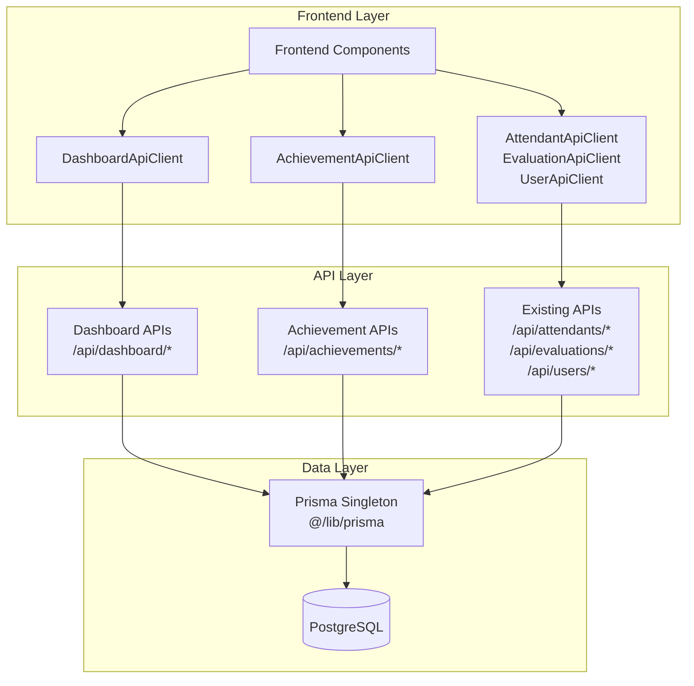

# Design Document

## Overview

Este documento detalha a arquitetura e estratégia para migrar completamente o uso direto do Prisma no frontend para uma arquitetura baseada em APIs REST. A migração aborda 178 itens identificados, incluindo serviços críticos do dashboard, processamento de conquistas, e múltiplas instâncias desnecessárias do PrismaClient.

A solução seguirá o padrão já estabelecido pelos API clients existentes (`AttendantApiClient`, `EvaluationApiClient`, `UserApiClient`) e criará novos endpoints e clients para funcionalidades que ainda usam Prisma diretamente.

## Architecture

### Current State Problems

1. **Frontend Services Using Prisma Directly (Critical)**:
   - `DashboardService` - 48 métodos usando `new PrismaClient()`
   - `RealtimeDashboardService` - 13 métodos usando `new PrismaClient()`
   - `AchievementProcessor` - 4 métodos usando `new PrismaClient()`
   - `AchievementCheckerService` - Verificação de conquistas usando Prisma

2. **Multiple PrismaClient Instances (43 files)**:
   - APIs criando `new PrismaClient()` ao invés de usar singleton
   - Desperdício de conexões de banco de dados
   - Inconsistência no padrão de acesso

3. **Legacy Prisma Services (66 usages)**:
   - `AttendantPrismaService`, `EvaluationPrismaService`, `UserPrismaService`
   - Ainda sendo usados em algumas APIs antigas
   - Devem ser completamente removidos

### Target Architecture



## Components and Interfaces

### 1. Dashboard API Client

**File**: `src/services/dashboardApiClient.ts`

```typescript
export class DashboardApiClient {
  // Métricas gerais
  static async getGeneralStats(): Promise<DashboardStats>
  static async getEvaluationTrend(days?: number): Promise<EvaluationTrend[]>
  static async getRatingDistribution(): Promise<RatingDistribution[]>
  static async getTopPerformers(limit?: number): Promise<TopPerformers[]>
  
  // Métricas de gamificação
  static async getGamificationOverview(): Promise<GamificationOverview>
  static async getMonthlyEvaluationStats(months?: number): Promise<MonthlyStats[]>
  static async getPopularAchievements(limit?: number): Promise<PopularAchievement[]>
  static async getRecentActivities(limit?: number): Promise<RecentActivity[]>
  
  // Métricas em tempo real
  static async getRealtimeMetrics(options?: RealtimeOptions): Promise<DashboardMetrics>
  static async getGamificationMetrics(seasonId?: string): Promise<GamificationMetrics>
  static async getSatisfactionMetrics(period?: string): Promise<SatisfactionMetrics>
  static async getAlertMetrics(thresholds?: AlertThresholds): Promise<AlertMetrics>
}
```

### 2. Achievement API Client

**File**: `src/services/achievementApiClient.ts`

```typescript
export class AchievementApiClient {
  // Processamento de conquistas
  static async processAchievementsForAttendant(attendantId: string): Promise<number>
  static async processAllAchievements(): Promise<ProcessResult>
  static async processSeasonAchievements(seasonId: string): Promise<ProcessResult>
  
  // Verificação de conquistas
  static async checkAchievementCriteria(attendantId: string, achievementId: string): Promise<boolean>
  static async getUnlockedAchievements(attendantId: string): Promise<UnlockedAchievement[]>
  static async getAvailableAchievements(): Promise<AchievementConfig[]>
  
  // Estatísticas de conquistas
  static async getAchievementStats(): Promise<AchievementStats>
  static async getPopularAchievements(limit?: number): Promise<PopularAchievement[]>
}
```

### 3. New API Endpoints

#### Dashboard Endpoints

- `GET /api/dashboard/stats` - Estatísticas gerais
- `GET /api/dashboard/realtime` - Métricas em tempo real
- `GET /api/dashboard/metrics` - Métricas consolidadas
- `GET /api/dashboard/evaluation-trend` - Tendência de avaliações
- `GET /api/dashboard/rating-distribution` - Distribuição de notas
- `GET /api/dashboard/top-performers` - Top performers
- `GET /api/dashboard/gamification-overview` - Visão geral da gamificação
- `GET /api/dashboard/satisfaction-metrics` - Métricas de satisfação
- `GET /api/dashboard/alert-metrics` - Métricas de alertas

#### Achievement Endpoints

- `POST /api/achievements/process` - Processar conquistas
- `POST /api/achievements/process-attendant` - Processar para atendente específico
- `POST /api/achievements/check` - Verificar critérios de conquista
- `GET /api/achievements/unlocked/:attendantId` - Conquistas desbloqueadas
- `GET /api/achievements/stats` - Estatísticas de conquistas
- `GET /api/achievements/popular` - Conquistas populares

### 4. Data Models

#### Dashboard Types

```typescript
export interface DashboardStats {
  totalEvaluations: number;
  totalAttendants: number;
  averageRating: number;
  totalXp: number;
  activeSeasons: number;
  unlockedAchievements: number;
}

export interface DashboardMetrics {
  gamification: GamificationMetrics;
  satisfaction: SatisfactionMetrics;
  alerts: AlertMetrics;
  lastUpdated: Date;
}

export interface GamificationMetrics {
  totalXp: number;
  activeUsers: number;
  topRanking: TopRankingItem[];
  recentAchievements: RecentAchievement[];
  xpTrend: XpTrendItem[];
}

export interface SatisfactionMetrics {
  averageRating: number;
  averageRating24h: number;
  totalEvaluations: EvaluationCounts;
  ratingDistribution: RatingDistribution;
  lowRatingAlerts: number;
  trend: SatisfactionTrendItem[];
}
```

#### Achievement Types

```typescript
export interface ProcessResult {
  attendantsProcessed: number;
  achievementsUnlocked: number;
  xpAwarded: number;
  errors: string[];
}

export interface AchievementStats {
  totalAchievements: number;
  activeAchievements: number;
  totalUnlocked: number;
  averageUnlocksPerAttendant: number;
}

export interface UnlockedAchievement {
  id: string;
  achievementId: string;
  attendantId: string;
  seasonId: string;
  unlockedAt: Date;
  xpGained: number;
}
```

## Error Handling

### 1. HTTP Client Error Handling

Todos os API clients seguirão o padrão estabelecido usando `HttpClientError`:

```typescript
try {
  const response = await httpClient.get<T>('/api/endpoint');
  return response.data;
} catch (error) {
  if (error instanceof HttpClientError) {
    if (error.status === 404) {
      return null; // Para recursos não encontrados
    }
    throw new Error(error.message);
  }
  throw new Error('Erro genérico apropriado');
}
```

### 2. API Endpoint Error Handling

Todos os endpoints seguirão o padrão de resposta de erro:

```typescript
export async function GET(request: Request) {
  try {
    // Lógica do endpoint
    return NextResponse.json(data);
  } catch (error) {
    console.error('Erro específico:', error);
    return NextResponse.json(
      { error: 'Mensagem de erro apropriada' },
      { status: 500 }
    );
  }
}
```

### 3. Validation Error Handling

Usar Zod para validação com mensagens claras:

```typescript
try {
  const validatedData = Schema.parse(data);
} catch (error) {
  if (error instanceof z.ZodError) {
    return NextResponse.json(
      { error: `Dados inválidos: ${error.errors.map(e => e.message).join(', ')}` },
      { status: 400 }
    );
  }
}
```

## Testing Strategy

### 1. Unit Tests for API Clients

Cada API client terá testes unitários mockando o `httpClient`:

```typescript
// dashboardApiClient.test.ts
jest.mock('@/lib/httpClient');
const mockHttpClient = httpClient as jest.Mocked<typeof httpClient>;

describe('DashboardApiClient', () => {
  beforeEach(() => {
    jest.clearAllMocks();
  });

  it('should fetch general stats', async () => {
    const mockStats = { totalEvaluations: 100 };
    mockHttpClient.get.mockResolvedValue({ data: mockStats });

    const result = await DashboardApiClient.getGeneralStats();
    
    expect(mockHttpClient.get).toHaveBeenCalledWith('/api/dashboard/stats');
    expect(result).toEqual(mockStats);
  });
});
```

### 2. Integration Tests for API Endpoints

Testes de integração para endpoints usando dados reais:

```typescript
// dashboard.integration.test.ts
describe('Dashboard API Integration', () => {
  it('should return dashboard stats', async () => {
    const response = await fetch('/api/dashboard/stats');
    const data = await response.json();
    
    expect(response.status).toBe(200);
    expect(data).toHaveProperty('totalEvaluations');
    expect(data).toHaveProperty('averageRating');
  });
});
```

### 3. Migration Validation Tests

Testes específicos para validar que a migração foi bem-sucedida:

```typescript
// migration-validation.test.ts
describe('Prisma Migration Validation', () => {
  it('should not have direct Prisma imports in frontend services', () => {
    // Verificar que serviços do frontend não importam Prisma
  });

  it('should use singleton Prisma instance in APIs', () => {
    // Verificar que APIs usam import { prisma } from '@/lib/prisma'
  });

  it('should not have legacy Prisma services', () => {
    // Verificar que serviços legados foram removidos
  });
});
```

## Performance Considerations

### 1. Caching Strategy

Implementar cache para métricas de dashboard que são computacionalmente caras:

```typescript
// Cache em memória para métricas que mudam pouco
const metricsCache = new Map<string, { data: any; timestamp: number }>();
const CACHE_TTL = 5 * 60 * 1000; // 5 minutos

export async function getCachedMetrics<T>(
  key: string,
  fetcher: () => Promise<T>
): Promise<T> {
  const cached = metricsCache.get(key);
  
  if (cached && Date.now() - cached.timestamp < CACHE_TTL) {
    return cached.data;
  }
  
  const data = await fetcher();
  metricsCache.set(key, { data, timestamp: Date.now() });
  
  return data;
}
```

### 2. Database Query Optimization

Otimizar queries complexas do dashboard usando:

- Índices apropriados no banco de dados
- Agregações eficientes
- Paginação quando necessário
- Queries paralelas com `Promise.all()`

### 3. Response Size Optimization

Limitar tamanho das respostas:

- Paginação para listas grandes
- Campos selecionados apenas quando necessário
- Compressão de resposta HTTP

## Security Considerations

### 1. Authentication & Authorization

Todos os novos endpoints seguirão o padrão de autenticação existente:

```typescript
import { getServerSession } from 'next-auth';
import { authOptions } from '@/lib/auth';

export async function GET(request: Request) {
  const session = await getServerSession(authOptions);
  
  if (!session) {
    return NextResponse.json({ error: 'Não autorizado' }, { status: 401 });
  }
  
  // Verificar permissões específicas se necessário
  if (session.user.role !== 'ADMIN' && session.user.role !== 'SUPERADMIN') {
    return NextResponse.json({ error: 'Acesso negado' }, { status: 403 });
  }
}
```

### 2. Input Validation

Validação rigorosa de entrada usando Zod:

```typescript
const QuerySchema = z.object({
  limit: z.coerce.number().min(1).max(100).default(10),
  offset: z.coerce.number().min(0).default(0),
  period: z.enum(['24h', '7d', '30d']).default('24h')
});
```

### 3. Rate Limiting

Implementar rate limiting para endpoints computacionalmente caros:

```typescript
import { rateLimit } from '@/lib/rateLimit';

export async function GET(request: Request) {
  const rateLimitResult = await rateLimit(request);
  
  if (!rateLimitResult.success) {
    return NextResponse.json(
      { error: 'Rate limit excedido' },
      { status: 429 }
    );
  }
}
```

## Migration Strategy

### Phase 1: Critical Frontend Services (Priority 1)

1. **Create Dashboard API Client** (`src/services/dashboardApiClient.ts`)
2. **Create Achievement API Client** (`src/services/achievementApiClient.ts`)
3. **Create Dashboard Endpoints** (`src/app/api/dashboard/*`)
4. **Create Achievement Endpoints** (`src/app/api/achievements/*`)
5. **Replace Frontend Service Usage**
6. **Remove Legacy Services**

### Phase 2: API Standardization (Priority 2)

1. **Replace `new PrismaClient()` with singleton**
2. **Update APIs to use API clients instead of Prisma services**
3. **Remove legacy Prisma service imports**

### Phase 3: Type Optimization (Priority 3)

1. **Evaluate Prisma type imports**
2. **Create local types where appropriate**
3. **Remove unnecessary Prisma type imports**

## Rollback Strategy

### 1. Feature Flags

Implementar feature flags para permitir rollback:

```typescript
const USE_NEW_DASHBOARD_API = process.env.USE_NEW_DASHBOARD_API === 'true';

export async function getStats() {
  if (USE_NEW_DASHBOARD_API) {
    return DashboardApiClient.getGeneralStats();
  } else {
    return DashboardService.getGeneralStats();
  }
}
```

### 2. Gradual Migration

Manter serviços antigos até validação completa:

- Implementar novos serviços em paralelo
- Testar extensivamente
- Migrar componente por componente
- Remover serviços antigos apenas após confirmação

### 3. Monitoring

Implementar monitoramento para detectar problemas:

- Logs detalhados de erros
- Métricas de performance
- Alertas para falhas críticas

## Success Criteria

### Technical Metrics

1. **Zero direct Prisma imports in frontend services**
2. **All APIs using singleton Prisma instance**
3. **All legacy Prisma services removed**
4. **100% test coverage for new API clients**
5. **All existing tests passing**

### Performance Metrics

1. **Dashboard load time < 2 seconds**
2. **API response time < 500ms for 95% of requests**
3. **Memory usage not increased by more than 10%**

### Quality Metrics

1. **Zero TypeScript compilation errors**
2. **Zero ESLint errors in migrated code**
3. **All new code following established patterns**