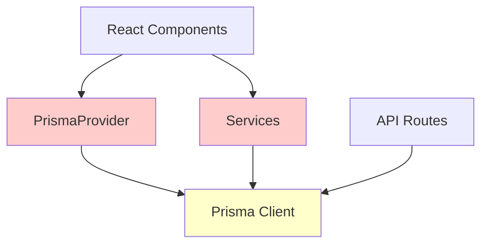
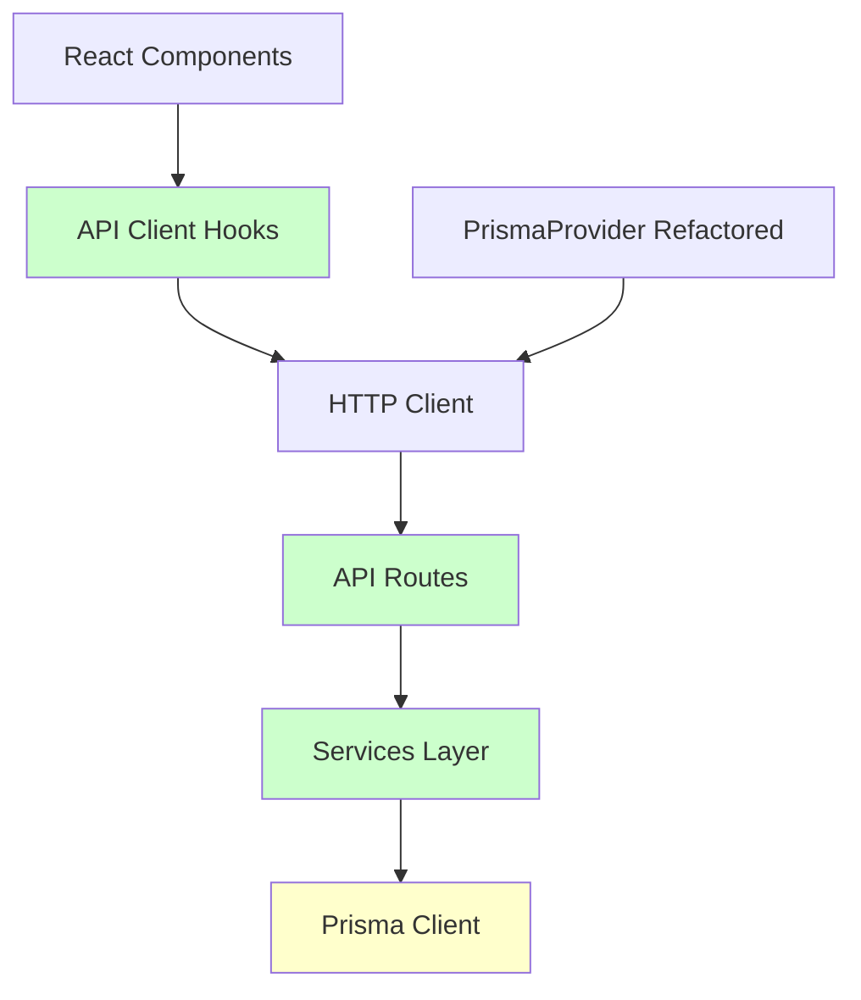

# Design Document

## Overview

Esta refatoração visa estabelecer uma arquitetura limpa e consistente onde toda comunicação com o banco de dados seja feita através de APIs REST padronizadas. O objetivo é eliminar o uso direto do Prisma ORM fora das rotas de API, criando uma separação clara entre a camada de apresentação (frontend/components) e a camada de dados (backend/API).

### Problemas Identificados

1. **Uso Inconsistente do Prisma**: Alguns serviços usam Prisma diretamente, outros usam APIs
2. **PrismaProvider Monolítico**: Provider com 2000+ linhas fazendo acesso direto ao banco
3. **Acoplamento Forte**: Componentes React dependem diretamente do Prisma
4. **Testabilidade Limitada**: Difícil mockar operações de banco em testes
5. **Escalabilidade Comprometida**: Não é possível separar frontend e backend facilmente

### Benefícios da Refatoração

- **Arquitetura Limpa**: Separação clara de responsabilidades
- **Testabilidade**: Fácil mockar APIs em testes unitários
- **Escalabilidade**: Possibilidade de separar frontend e backend
- **Manutenibilidade**: Código mais organizado e fácil de manter
- **Consistência**: Padrão único de acesso a dados

## Architecture

### Current Architecture (Problematic)



### Target Architecture (Clean)



### Layer Responsibilities

1. **React Components**: UI rendering and user interaction
2. **API Client Hooks**: Data fetching, caching, and state management
3. **HTTP Client**: Network communication with retry logic
4. **API Routes**: Request validation, authentication, and response formatting
5. **Services Layer**: Business logic and data transformation
6. **Prisma Client**: Database operations (only in API routes)

## Components and Interfaces

### 1. HTTP Client Service

**Location**: `src/lib/httpClient.ts`

```typescript
interface HttpClientConfig {
  baseURL?: string;
  timeout?: number;
  retries?: number;
  retryDelay?: number;
}

interface ApiResponse<T> {
  data: T;
  success: boolean;
  error?: string;
  message?: string;
}

class HttpClient {
  get<T>(url: string, config?: RequestInit): Promise<ApiResponse<T>>
  post<T>(url: string, data: any, config?: RequestInit): Promise<ApiResponse<T>>
  put<T>(url: string, data: any, config?: RequestInit): Promise<ApiResponse<T>>
  delete<T>(url: string, config?: RequestInit): Promise<ApiResponse<T>>
}
```

### 2. API Client Hooks

**Location**: `src/hooks/api/`

```typescript
// useApiQuery - For GET operations
interface UseApiQueryOptions<T> {
  enabled?: boolean;
  refetchOnWindowFocus?: boolean;
  staleTime?: number;
  cacheTime?: number;
}

function useApiQuery<T>(
  key: string[], 
  url: string, 
  options?: UseApiQueryOptions<T>
): {
  data: T | undefined;
  loading: boolean;
  error: string | null;
  refetch: () => void;
}

// useApiMutation - For POST/PUT/DELETE operations
function useApiMutation<TData, TVariables>(
  mutationFn: (variables: TVariables) => Promise<ApiResponse<TData>>
): {
  mutate: (variables: TVariables) => Promise<void>;
  loading: boolean;
  error: string | null;
  data: TData | undefined;
}
```

### 3. Refactored Services

**Pattern**: Services will be converted to API clients

```typescript
// Before (Direct Prisma)
export class UserService {
  static async findAll(): Promise<User[]> {
    return await prisma.user.findMany();
  }
}

// After (API Client)
export class UserApiClient {
  static async findAll(): Promise<User[]> {
    const response = await httpClient.get<User[]>('/api/users');
    return response.data;
  }
}
```

### 4. Refactored PrismaProvider

**New Name**: `ApiProvider`
**Location**: `src/providers/ApiProvider.tsx`

```typescript
interface ApiContextType {
  // Data states using API hooks
  attendants: UseApiQueryResult<Attendant[]>;
  evaluations: UseApiQueryResult<Evaluation[]>;
  users: UseApiQueryResult<User[]>;
  
  // Mutation functions
  createUser: UseMutationResult<User, CreateUserData>;
  updateUser: UseMutationResult<User, UpdateUserData>;
  deleteUser: UseMutationResult<void, string>;
  
  // Global states
  isLoading: boolean;
  hasError: boolean;
  refetchAll: () => void;
}
```

## Data Models

### API Response Standards

All API responses will follow this standard format:

```typescript
interface ApiResponse<T> {
  success: boolean;
  data: T;
  message?: string;
  error?: string;
  pagination?: {
    page: number;
    limit: number;
    total: number;
    totalPages: number;
  };
}

interface ApiError {
  success: false;
  error: string;
  details?: Record<string, string[]>; // Validation errors
  code?: string;
}
```

### Entity Interfaces

Maintain existing TypeScript interfaces from `@/lib/types`:

- `User`, `Attendant`, `Evaluation`
- `GamificationConfig`, `Achievement`, `XpEvent`
- `Module`, `Funcao`, `Setor`

### API Endpoints Mapping

| Entity | Current Service | Target API Endpoints |
|--------|----------------|---------------------|
| Users | `userService.ts` | `/api/users` (GET, POST, PUT, DELETE) |
| Attendants | `attendantService.ts` | `/api/attendants` (GET, POST, PUT, DELETE) |
| Evaluations | `evaluationService.ts` | `/api/evaluations` (GET, POST, PUT, DELETE) |
| Modules | `moduleService.ts` | `/api/modules` (GET, POST, PUT, DELETE) |
| Gamification | `gamificationService.ts` | `/api/gamification/*` (multiple endpoints) |
| RH Config | `rhService.ts` | `/api/funcoes`, `/api/setores` |
| XP Avulso | `xpAvulsoService.ts` | `/api/gamification/xp-grants` |

## Error Handling

### Centralized Error Handling

```typescript
interface ApiErrorHandler {
  handleNetworkError(error: Error): void;
  handleValidationError(errors: Record<string, string[]>): void;
  handleAuthError(): void;
  handleServerError(error: string): void;
}

class ErrorHandler implements ApiErrorHandler {
  // Show toast notifications
  // Log errors to console/service
  // Handle authentication redirects
  // Maintain error state
}
```

### Retry Logic

```typescript
interface RetryConfig {
  maxRetries: number;
  retryDelay: number;
  retryCondition: (error: Error) => boolean;
}

// Automatic retry for:
// - Network timeouts
// - 5xx server errors
// - Connection failures

// No retry for:
// - 4xx client errors
// - Authentication errors
// - Validation errors
```

## Testing Strategy

### 1. API Route Testing

```typescript
// Test API routes with mocked Prisma
describe('/api/users', () => {
  beforeEach(() => {
    jest.clearAllMocks();
  });

  it('should return users list', async () => {
    const mockUsers = [{ id: '1', name: 'Test User' }];
    prismaMock.user.findMany.mockResolvedValue(mockUsers);
    
    const response = await GET();
    expect(response.status).toBe(200);
  });
});
```

### 2. Hook Testing

```typescript
// Test API hooks with mocked HTTP client
describe('useUsers', () => {
  it('should fetch users successfully', async () => {
    const mockUsers = [{ id: '1', name: 'Test User' }];
    httpClientMock.get.mockResolvedValue({ 
      success: true, 
      data: mockUsers 
    });
    
    const { result } = renderHook(() => useUsers());
    
    await waitFor(() => {
      expect(result.current.data).toEqual(mockUsers);
    });
  });
});
```

### 3. Integration Testing

```typescript
// Test complete flow from component to API
describe('User Management Integration', () => {
  it('should create user successfully', async () => {
    render(<UserForm />);
    
    fireEvent.change(screen.getByLabelText('Nome'), {
      target: { value: 'New User' }
    });
    
    fireEvent.click(screen.getByText('Salvar'));
    
    await waitFor(() => {
      expect(screen.getByText('Usuário criado com sucesso')).toBeInTheDocument();
    });
  });
});
```

### 4. Service Layer Testing

```typescript
// Test refactored services
describe('UserApiClient', () => {
  it('should handle API errors gracefully', async () => {
    httpClientMock.get.mockRejectedValue(new Error('Network error'));
    
    await expect(UserApiClient.findAll()).rejects.toThrow('Network error');
  });
});
```

## Migration Strategy

### Phase 1: Infrastructure Setup
1. Create HTTP client service
2. Create base API hooks (useApiQuery, useApiMutation)
3. Set up error handling infrastructure
4. Create API response standards

### Phase 2: Service Migration
1. Migrate `userService.ts` → `UserApiClient`
2. Migrate `attendantService.ts` → `AttendantApiClient`
3. Migrate `evaluationService.ts` → `EvaluationApiClient`
4. Migrate `moduleService.ts` → `ModuleApiClient`

### Phase 3: Provider Refactoring
1. Create new `ApiProvider` using API hooks
2. Maintain backward compatibility with existing interface
3. Gradually migrate components to use new provider
4. Remove old `PrismaProvider` when migration is complete

### Phase 4: Hook Migration
1. Refactor `useUsersData` to use API hooks
2. Refactor `useEvaluationsData` to use API hooks
3. Refactor `useModulesData` to use API hooks
4. Refactor `useRhConfigData` to use API hooks

### Phase 5: Component Updates
1. Update components to use refactored hooks
2. Remove direct Prisma imports from components
3. Update error handling to use new error system
4. Test all functionality end-to-end

### Phase 6: Cleanup
1. Remove unused Prisma imports
2. Remove old service files
3. Update documentation
4. Run full test suite

## Performance Considerations

### Caching Strategy
- Implement query caching in API hooks
- Use stale-while-revalidate pattern
- Cache invalidation on mutations

### Batch Operations
- Support batch operations in APIs where needed
- Optimize database queries in API routes
- Use database transactions for related operations

### Loading States
- Implement proper loading states in hooks
- Show skeleton loaders during data fetching
- Handle concurrent requests efficiently

## Security Considerations

### Authentication
- Maintain existing NextAuth.js integration
- Validate authentication in all API routes
- Handle token refresh automatically

### Authorization
- Implement role-based access control in API routes
- Validate user permissions before operations
- Log security-related events

### Data Validation
- Validate all input data in API routes
- Sanitize data before database operations
- Return appropriate error messages for validation failures