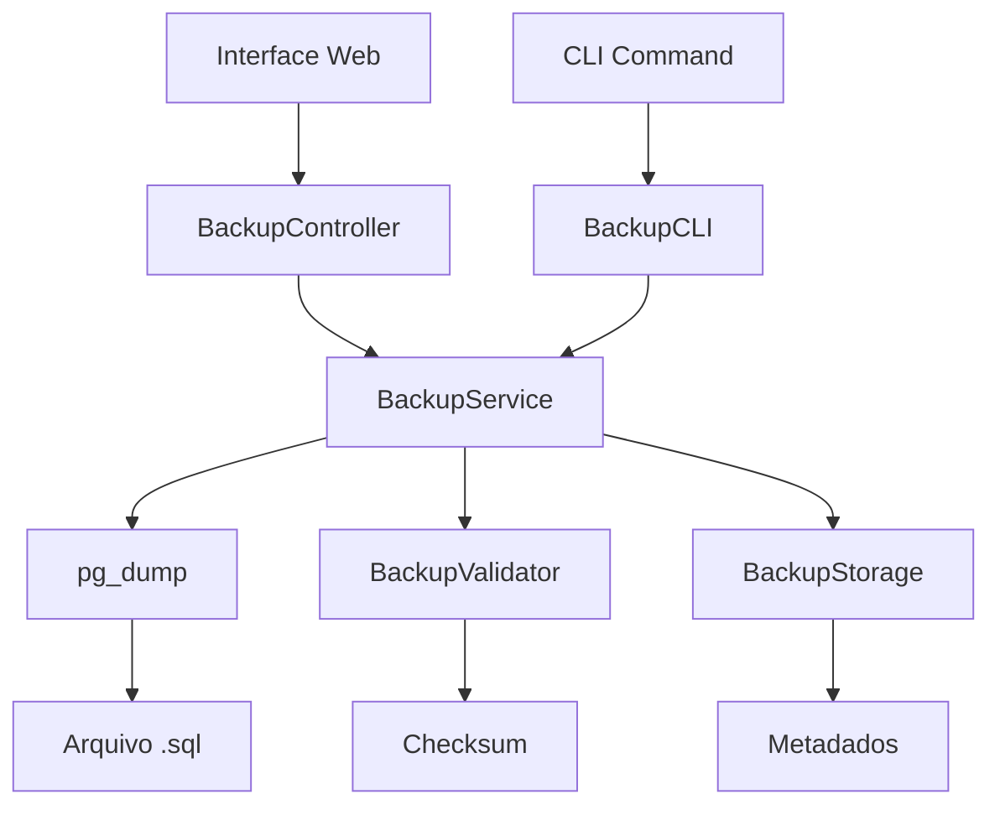

# Design Document

## Overview

O sistema de backup do banco de dados será implementado como um módulo completo que oferece funcionalidades de backup tanto via interface web quanto por linha de comando. O sistema utilizará o `pg_dump` nativo do PostgreSQL para garantir backups consistentes e confiáveis, integrando-se com a arquitetura existente do projeto Next.js.

## Architecture

### Componentes Principais

1. **BackupService** - Serviço principal que gerencia operações de backup
2. **BackupController** - API endpoints para operações via web
3. **BackupCLI** - Script executável para linha de comando
4. **BackupUI** - Interface web para gerenciamento de backups
5. **BackupValidator** - Validador de integridade dos arquivos
6. **BackupStorage** - Gerenciador de armazenamento e metadados

### Fluxo de Dados



## Components and Interfaces

### BackupService

```typescript
interface BackupOptions {
  filename?: string;
  directory?: string;
  includeData?: boolean;
  includeSchema?: boolean;
  compress?: boolean;
}

interface BackupResult {
  success: boolean;
  filename: string;
  filepath: string;
  size: number;
  checksum: string;
  duration: number;
  error?: string;
}

interface BackupMetadata {
  id: string;
  filename: string;
  filepath: string;
  size: number;
  checksum: string;
  createdAt: Date;
  createdBy?: string;
  status: 'success' | 'failed' | 'in_progress';
  duration: number;
  databaseVersion: string;
  schemaVersion: string;
}

class BackupService {
  static async createBackup(options?: BackupOptions): Promise<BackupResult>
  static async listBackups(): Promise<BackupMetadata[]>
  static async validateBackup(filepath: string): Promise<boolean>
  static async deleteBackup(backupId: string): Promise<boolean>
  static async getBackupInfo(backupId: string): Promise<BackupMetadata | null>
}
```

### BackupController (API Routes)

```typescript
// POST /api/backup/create
interface CreateBackupRequest {
  options?: BackupOptions;
}

// GET /api/backup/list
interface ListBackupsResponse {
  backups: BackupMetadata[];
}

// GET /api/backup/download/[id]
// Retorna o arquivo de backup para download

// DELETE /api/backup/[id]
interface DeleteBackupResponse {
  success: boolean;
  message: string;
}

// GET /api/backup/status/[id]
interface BackupStatusResponse {
  status: 'in_progress' | 'completed' | 'failed';
  progress?: number;
  message?: string;
}
```

### BackupCLI

```bash
# Comandos disponíveis
npm run backup:create [options]
npm run backup:list
npm run backup:validate <filepath>
npm run backup:cleanup <days>

# Opções do create
--output, -o <directory>    # Diretório de saída
--name, -n <filename>       # Nome do arquivo
--compress, -c              # Comprimir arquivo
--schema-only              # Apenas estrutura
--data-only                # Apenas dados
--verbose, -v              # Saída detalhada
```

### BackupUI Components

```typescript
// Componente principal da página de backup
interface BackupManagerProps {
  userRole: Role;
}

// Componente de criação de backup
interface CreateBackupFormProps {
  onBackupCreated: (backup: BackupMetadata) => void;
}

// Componente de lista de backups
interface BackupListProps {
  backups: BackupMetadata[];
  onDelete: (backupId: string) => void;
  onDownload: (backupId: string) => void;
}

// Componente de progresso
interface BackupProgressProps {
  isActive: boolean;
  progress: number;
  message: string;
}
```

## Data Models

### Backup Metadata Storage

```typescript
// Armazenado em arquivo JSON local para simplicidade
interface BackupRegistry {
  backups: BackupMetadata[];
  lastCleanup: Date;
  settings: {
    maxBackups: number;
    retentionDays: number;
    defaultDirectory: string;
  };
}
```

### Database Schema Extensions

Não será necessário adicionar novas tabelas ao banco, pois os metadados serão armazenados em arquivos JSON locais para evitar dependência circular (backup do sistema de backup).

## Error Handling

### Tipos de Erro

1. **DatabaseConnectionError** - Falha na conexão com o banco
2. **BackupCreationError** - Erro durante criação do backup
3. **FileSystemError** - Problemas de acesso ao sistema de arquivos
4. **ValidationError** - Falha na validação de integridade
5. **PermissionError** - Falta de permissões adequadas
6. **DiskSpaceError** - Espaço insuficiente em disco

### Estratégias de Recuperação

```typescript
interface ErrorRecoveryStrategy {
  retryAttempts: number;
  backoffDelay: number;
  fallbackActions: string[];
}

const errorStrategies = {
  DatabaseConnectionError: {
    retryAttempts: 3,
    backoffDelay: 5000,
    fallbackActions: ['check_connection', 'retry_with_timeout']
  },
  DiskSpaceError: {
    retryAttempts: 1,
    backoffDelay: 0,
    fallbackActions: ['cleanup_old_backups', 'compress_backup']
  }
};
```

## Testing Strategy

### Unit Tests

1. **BackupService Tests**
   - Criação de backup com diferentes opções
   - Validação de integridade
   - Listagem e exclusão de backups
   - Tratamento de erros

2. **BackupValidator Tests**
   - Validação de arquivos válidos
   - Detecção de arquivos corrompidos
   - Cálculo de checksums

3. **BackupCLI Tests**
   - Execução de comandos com diferentes parâmetros
   - Códigos de saída corretos
   - Saída formatada adequadamente

### Integration Tests

1. **API Endpoints Tests**
   - Criação de backup via API
   - Download de arquivos
   - Autenticação e autorização
   - Rate limiting

2. **End-to-End Tests**
   - Fluxo completo via interface web
   - Backup e restauração real
   - Validação de dados restaurados

### Performance Tests

1. **Backup Size Tests**
   - Tempo de backup para diferentes tamanhos de banco
   - Uso de memória durante operações
   - Compressão efetiva

2. **Concurrent Operations**
   - Múltiplos backups simultâneos
   - Backup durante operações normais do sistema

## Security Considerations

### Controle de Acesso

```typescript
const backupPermissions = {
  SUPERADMIN: ['create', 'list', 'download', 'delete', 'validate'],
  ADMIN: ['create', 'list', 'download', 'delete', 'validate'],
  SUPERVISOR: ['list', 'download'],
  USUARIO: [] // Sem acesso
};
```

### Proteção de Dados

1. **Criptografia em Trânsito** - HTTPS para downloads
2. **Validação de Entrada** - Sanitização de parâmetros
3. **Rate Limiting** - Limite de operações por usuário
4. **Audit Log** - Log de todas as operações de backup
5. **Secure Storage** - Backups armazenados fora do webroot

### Configurações de Segurança

```typescript
interface SecurityConfig {
  maxBackupsPerUser: number;
  maxBackupSizeGB: number;
  allowedDirectories: string[];
  encryptBackups: boolean;
  auditLogRetentionDays: number;
}
```

## Implementation Details

### File Structure

```
src/
├── services/
│   ├── backupService.ts
│   ├── backupValidator.ts
│   └── backupStorage.ts
├── app/
│   ├── api/backup/
│   │   ├── create/route.ts
│   │   ├── list/route.ts
│   │   ├── download/[id]/route.ts
│   │   ├── delete/[id]/route.ts
│   │   └── status/[id]/route.ts
│   └── dashboard/backup/
│       └── page.tsx
├── components/
│   └── backup/
│       ├── BackupManager.tsx
│       ├── CreateBackupForm.tsx
│       ├── BackupList.tsx
│       └── BackupProgress.tsx
└── scripts/
    └── backup-cli.ts

backups/
├── registry.json
└── files/
    ├── backup_2025-01-09_14-30-00.sql
    └── backup_2025-01-09_15-45-30.sql.gz
```

### Environment Variables

```env
# Configurações de backup
BACKUP_DIRECTORY=/app/backups
BACKUP_MAX_SIZE_GB=10
BACKUP_RETENTION_DAYS=30
BACKUP_MAX_CONCURRENT=2
BACKUP_ENABLE_COMPRESSION=true
BACKUP_ENABLE_ENCRYPTION=false

# Configurações do PostgreSQL para pg_dump
PGDUMP_PATH=/usr/bin/pg_dump
PGDUMP_TIMEOUT=3600
```

### Dependencies

```json
{
  "dependencies": {
    "node-cron": "^3.0.3",
    "archiver": "^6.0.1",
    "crypto": "built-in"
  },
  "devDependencies": {
    "@types/archiver": "^6.0.2"
  }
}
```

## Monitoring and Maintenance

### Metrics to Track

1. **Backup Success Rate** - Percentual de backups bem-sucedidos
2. **Backup Duration** - Tempo médio de criação
3. **Backup Size Trends** - Crescimento do tamanho dos backups
4. **Storage Usage** - Espaço utilizado pelos backups
5. **Error Frequency** - Frequência de diferentes tipos de erro

### Automated Maintenance

```typescript
interface MaintenanceConfig {
  autoCleanupEnabled: boolean;
  cleanupSchedule: string; // cron expression
  maxBackupsToKeep: number;
  maxStorageSizeGB: number;
  compressionThresholdMB: number;
}
```

### Health Checks

1. **Storage Space Check** - Verificar espaço disponível
2. **Database Connectivity** - Testar conexão com PostgreSQL
3. **Backup Integrity** - Validar backups existentes periodicamente
4. **Permission Check** - Verificar permissões de escrita