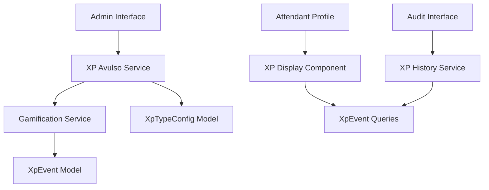

# Design Document

## Overview

O sistema de XP avulso será implementado como uma extensão do sistema de gamificação existente, permitindo que administradores concedam pontos de experiência extras através de tipos pré-cadastrados. A solução integra-se perfeitamente com a arquitetura atual, reutilizando o modelo `XpEvent` e o `GamificationService` para manter consistência e aproveitar funcionalidades como multiplicadores sazonais e verificação automática de conquistas.

## Architecture

### High-Level Architecture



### Integration Points

1. **Gamification Service Integration**: Utiliza `GamificationService.createXpEvent()` existente
2. **Authentication**: Integra com NextAuth.js e sistema de roles existente
3. **Database**: Estende schema Prisma com novo modelo `XpTypeConfig`
4. **UI Components**: Reutiliza componentes shadcn/ui existentes
5. **API Layer**: Segue padrão de API routes do Next.js App Router

## Components and Interfaces

### Database Models

#### XpTypeConfig (Novo)
```prisma
model XpTypeConfig {
  id          String   @id @default(cuid())
  name        String   @unique
  description String
  points      Int
  active      Boolean  @default(true)
  category    String   @default("general")
  icon        String   @default("star")
  color       String   @default("#3B82F6")
  createdAt   DateTime @default(now())
  updatedAt   DateTime @updatedAt
  createdBy   String
  creator     User     @relation(fields: [createdBy], references: [id])
}
```

#### XpGrant (Novo)
```prisma
model XpGrant {
  id           String       @id @default(cuid())
  attendantId  String
  typeId       String
  points       Int
  justification String?
  grantedBy    String
  grantedAt    DateTime     @default(now())
  xpEventId    String       @unique
  attendant    Attendant    @relation(fields: [attendantId], references: [id])
  type         XpTypeConfig @relation(fields: [typeId], references: [id])
  granter      User         @relation(fields: [grantedBy], references: [id])
  xpEvent      XpEvent      @relation(fields: [xpEventId], references: [id])
}
```

### Service Layer

#### XpAvulsoService
```typescript
export class XpAvulsoService {
  // Gerenciamento de tipos
  static async createXpType(data: CreateXpTypeData): Promise<XpTypeConfig>
  static async updateXpType(id: string, data: UpdateXpTypeData): Promise<XpTypeConfig>
  static async findAllXpTypes(activeOnly?: boolean): Promise<XpTypeConfig[]>
  static async toggleXpTypeStatus(id: string): Promise<XpTypeConfig>
  
  // Concessão de XP
  static async grantXp(data: GrantXpData): Promise<XpGrant>
  static async findGrantHistory(filters: GrantHistoryFilters): Promise<XpGrant[]>
  static async findGrantsByAttendant(attendantId: string): Promise<XpGrant[]>
  
  // Validações e limites
  static async validateGrantLimits(granterId: string, points: number): Promise<void>
  static async getGrantStatistics(period: string): Promise<GrantStatistics>
}
```

### API Endpoints

#### XP Types Management
- `GET /api/gamification/xp-types` - Listar tipos de XP
- `POST /api/gamification/xp-types` - Criar tipo de XP
- `PUT /api/gamification/xp-types/[id]` - Atualizar tipo de XP
- `DELETE /api/gamification/xp-types/[id]` - Desativar tipo de XP

#### XP Granting
- `POST /api/gamification/xp-grants` - Conceder XP avulso
- `GET /api/gamification/xp-grants` - Histórico de concessões
- `GET /api/gamification/xp-grants/attendant/[id]` - Concessões por atendente

### UI Components

#### XpTypeManager
- Lista de tipos configurados
- Formulário de criação/edição
- Ações de ativar/desativar
- Validação de dados

#### XpGrantInterface
- Seleção de atendente
- Seleção de tipo de XP
- Campo de justificativa opcional
- Confirmação de concessão
- Feedback visual

#### XpGrantHistory
- Tabela com filtros avançados
- Exportação para CSV
- Detalhes de cada concessão
- Métricas de uso

#### AttendantXpDisplay
- XP total separado por fonte
- Histórico de XP avulso recebido
- Notificações de novas concessões

## Data Models

### XP Type Configuration
```typescript
interface XpTypeConfig {
  id: string;
  name: string;
  description: string;
  points: number;
  active: boolean;
  category: string;
  icon: string;
  color: string;
  createdAt: Date;
  updatedAt: Date;
  createdBy: string;
}
```

### XP Grant Record
```typescript
interface XpGrant {
  id: string;
  attendantId: string;
  typeId: string;
  points: number;
  justification?: string;
  grantedBy: string;
  grantedAt: Date;
  xpEventId: string;
  // Relations
  attendant: Attendant;
  type: XpTypeConfig;
  granter: User;
  xpEvent: XpEvent;
}
```

### Grant Filters
```typescript
interface GrantHistoryFilters {
  attendantId?: string;
  typeId?: string;
  granterId?: string;
  startDate?: Date;
  endDate?: Date;
  minPoints?: number;
  maxPoints?: number;
  page?: number;
  limit?: number;
}
```

## Error Handling

### Validation Errors
- Tipos de XP: nome único, pontos positivos, campos obrigatórios
- Concessões: atendente válido, tipo ativo, temporada ativa
- Permissões: apenas ADMIN e SUPERADMIN podem conceder

### Business Logic Errors
- Limites de concessão por período
- Tipos inativos não podem ser usados
- Temporada inativa impede concessões
- Atendente inexistente ou inativo

### Security Measures
- Rate limiting para concessões
- Auditoria completa de todas as ações
- Validação de permissões em todas as operações
- Logs detalhados para investigação

## Testing Strategy

### Unit Tests
- XpAvulsoService: todas as operações CRUD
- Validações de dados e regras de negócio
- Cálculos de limites e estatísticas
- Integração com GamificationService

### Integration Tests
- API endpoints com diferentes roles
- Fluxo completo de concessão de XP
- Verificação de conquistas após concessão
- Persistência de dados no banco

### Component Tests
- Formulários de criação/edição
- Interfaces de concessão
- Exibição de histórico
- Responsividade e acessibilidade

### E2E Tests
- Fluxo completo do administrador
- Experiência do atendente
- Relatórios e exportações
- Cenários de erro e recuperação

## Security Considerations

### Access Control
- Role-based permissions (ADMIN, SUPERADMIN)
- Middleware de autenticação em todas as rotas
- Validação de permissões no frontend e backend

### Data Protection
- Sanitização de inputs
- Validação de tipos TypeScript
- Proteção contra SQL injection via Prisma
- Rate limiting para prevenir abuso

### Audit Trail
- Log completo de todas as concessões
- Rastreamento de quem concedeu XP
- Histórico imutável de ações
- Relatórios de auditoria

## Performance Optimization

### Database Optimization
- Índices em campos de busca frequente
- Paginação para listas grandes
- Queries otimizadas com includes seletivos
- Cache de tipos de XP ativos

### Frontend Optimization
- Lazy loading de componentes
- Debounce em campos de busca
- Virtualization para listas grandes
- Otimização de re-renders

### API Optimization
- Compressão de responses
- Caching de dados estáticos
- Batch operations quando possível
- Validação eficiente de dados

## Migration Strategy

### Database Migration
1. Criar tabelas XpTypeConfig e XpGrant
2. Adicionar índices necessários
3. Criar tipos padrão de XP avulso
4. Atualizar relacionamentos existentes

### Code Migration
1. Implementar serviços base
2. Criar API endpoints
3. Desenvolver componentes UI
4. Integrar com sistema existente

### Data Migration
1. Não há dados existentes para migrar
2. Criar tipos padrão via seed
3. Configurar permissões iniciais
4. Testes de integridade

## Monitoring and Analytics

### Key Metrics
- Número de concessões por período
- Distribuição de XP por tipo
- Uso por administrador
- Impacto nas conquistas

### Alerting
- Concessões suspeitas (muito XP)
- Falhas de sistema
- Problemas de performance
- Tentativas de acesso não autorizado

### Reporting
- Relatórios mensais de uso
- Análise de impacto na gamificação
- Estatísticas por atendente
- Efetividade dos tipos de XP