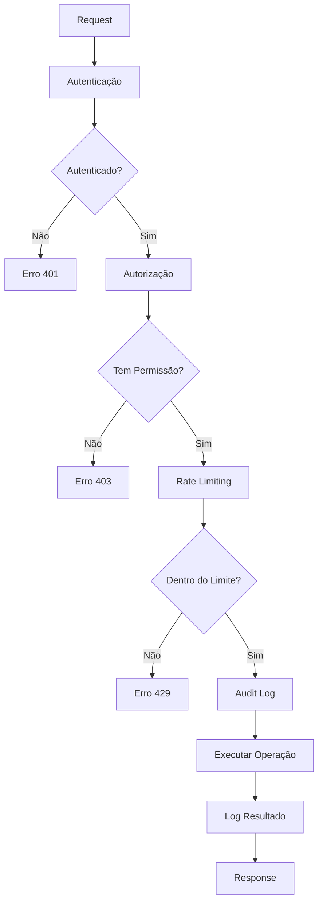

# Sistema de Segurança para Backup

Este documento descreve o sistema de segurança implementado para as operações de backup do banco de dados.

## Visão Geral

O sistema de segurança implementa múltiplas camadas de proteção:

1. **Autenticação e Autorização** - Controle baseado em roles
2. **Rate Limiting** - Proteção contra abuso
3. **Audit Log** - Rastreamento de todas as operações
4. **Middleware Unificado** - Aplicação consistente de segurança

## Componentes

### 1. Autenticação e Autorização (`backupAuth.ts`)

#### Permissões por Role

```typescript
const BACKUP_PERMISSIONS = {
  SUPERADMIN: {
    canCreate: true,
    canList: true,
    canDownload: true,
    canDelete: true,
    canValidate: true,
  },
  ADMIN: {
    canCreate: true,
    canList: true,
    canDownload: true,
    canDelete: true,
    canValidate: true,
  },
  SUPERVISOR: {
    canCreate: false,
    canList: true,
    canDownload: true,
    canDelete: false,
    canValidate: false,
  },
  USUARIO: {
    canCreate: false,
    canList: false,
    canDownload: false,
    canDelete: false,
    canValidate: false,
  },
};
```

#### Funções Principais

- `authenticateBackupRequest()` - Verifica se o usuário está autenticado
- `hasBackupPermission()` - Verifica se o role tem permissão para uma operação
- `authorizeBackupOperation()` - Combina autenticação e autorização
- `createAuthErrorResponse()` - Cria respostas de erro padronizadas

### 2. Rate Limiting (`backupRateLimit.ts`)

#### Limites por Role e Operação

```typescript
const RATE_LIMIT_CONFIGS = {
  SUPERADMIN: {
    create: { windowMs: 60 * 1000, maxRequests: 10 },
    list: { windowMs: 60 * 1000, maxRequests: 60 },
    download: { windowMs: 60 * 1000, maxRequests: 20 },
    delete: { windowMs: 60 * 1000, maxRequests: 30 },
  },
  ADMIN: {
    create: { windowMs: 60 * 1000, maxRequests: 8 },
    list: { windowMs: 60 * 1000, maxRequests: 50 },
    download: { windowMs: 60 * 1000, maxRequests: 15 },
    delete: { windowMs: 60 * 1000, maxRequests: 20 },
  },
  SUPERVISOR: {
    list: { windowMs: 60 * 1000, maxRequests: 30 },
    download: { windowMs: 60 * 1000, maxRequests: 10 },
  },
};
```

#### Funcionalidades

- **Rate limiting por usuário e operação**
- **Inclusão de IP para proteção adicional**
- **Limpeza automática de entradas expiradas**
- **Reset manual para administradores**
- **Estatísticas de uso**

### 3. Audit Log (`backupAuditLog.ts`)

#### Estrutura do Log

```typescript
interface BackupAuditEntry {
  id: string;
  timestamp: Date;
  userId: string;
  userEmail: string;
  userRole: Role;
  operation: 'create' | 'list' | 'download' | 'delete' | 'validate';
  resource?: string;
  success: boolean;
  error?: string;
  metadata?: Record<string, any>;
  ipAddress?: string;
  userAgent?: string;
}
```

#### Funcionalidades

- **Log de todas as operações** (sucesso e falha)
- **Rotação automática** quando arquivo excede 10MB
- **Filtros e busca** por usuário, operação, data, etc.
- **Estatísticas** de uso e performance
- **Limpeza automática** de entradas antigas
- **Retenção configurável** (padrão: 90 dias)

### 4. Middleware Unificado (`backupSecurityMiddleware.ts`)

#### Fluxo de Segurança



#### Função Principal

```typescript
export async function withBackupSecurity<T>(
  request: NextRequest,
  operation: keyof BackupPermissions,
  handler: (context: SecurityContext) => Promise<T>
): Promise<Response>
```

## Endpoints de Segurança

### 1. Audit Log (`/api/backup/audit`)

#### GET - Visualizar Logs
- **Permissão**: ADMIN, SUPERADMIN
- **Parâmetros**: userId, operation, success, startDate, endDate, limit, page
- **Resposta**: Lista paginada de entradas de audit

#### POST - Operações de Manutenção
- **Permissão**: SUPERADMIN
- **Ações**:
  - `cleanup` - Remove entradas antigas
  - `stats` - Estatísticas do audit log

### 2. Rate Limit (`/api/backup/rate-limit`)

#### GET - Visualizar Rate Limits
- **Permissão**: ADMIN, SUPERLADMIN
- **Parâmetros**: userId (opcional)
- **Resposta**: Estatísticas de rate limiting

#### POST - Gerenciar Rate Limits
- **Permissão**: SUPERADMIN
- **Ações**:
  - `reset` - Reseta rate limit de usuário
  - `cleanup` - Remove entradas expiradas
  - `stats` - Estatísticas gerais

## Implementação nos Endpoints

### Antes (Sem Segurança Unificada)

```typescript
export async function POST(request: NextRequest) {
  // Verificação manual de autenticação
  const session = await getServerSession(authOptions);
  if (!session?.user) {
    return NextResponse.json({ error: 'Não autenticado' }, { status: 401 });
  }

  // Verificação manual de permissões
  const userRole = session.user.role as Role;
  if (!['ADMIN', 'SUPERADMIN'].includes(userRole)) {
    return NextResponse.json({ error: 'Sem permissão' }, { status: 403 });
  }

  // Rate limiting manual
  if (!checkRateLimit(session.user.id)) {
    return NextResponse.json({ error: 'Rate limit' }, { status: 429 });
  }

  // Lógica da operação...
}
```

### Depois (Com Segurança Unificada)

```typescript
export async function POST(request: NextRequest) {
  return withBackupSecurity(request, 'canCreate', async (context) => {
    // Lógica da operação com contexto seguro...
    // context.user contém informações do usuário autenticado
    // Audit log é automaticamente registrado
    return result;
  });
}
```

## Configuração e Monitoramento

### Variáveis de Ambiente

```env
# Configurações de audit log
BACKUP_AUDIT_RETENTION_DAYS=90
BACKUP_AUDIT_MAX_SIZE_MB=10
BACKUP_AUDIT_MAX_FILES=5

# Configurações de rate limiting
BACKUP_RATE_LIMIT_WINDOW_MS=60000
BACKUP_RATE_LIMIT_CLEANUP_INTERVAL_MS=300000
```

### Monitoramento

#### Métricas Importantes

1. **Taxa de Sucesso** - Percentual de operações bem-sucedidas
2. **Rate Limit Hits** - Frequência de rate limits atingidos
3. **Tentativas Não Autorizadas** - Tentativas de acesso negado
4. **Tempo de Resposta** - Performance das operações de segurança

#### Alertas Recomendados

1. **Alta Taxa de Falhas** - > 10% de operações falhando
2. **Muitos Rate Limits** - > 50 rate limits por hora
3. **Tentativas Suspeitas** - > 10 tentativas não autorizadas por IP
4. **Arquivo de Audit Grande** - > 50MB de logs

## Testes

### Cobertura de Testes

- ✅ **Autenticação e Autorização** - 100% cobertura
- ✅ **Rate Limiting** - 100% cobertura  
- ✅ **Audit Log** - 95% cobertura
- ✅ **Middleware** - 90% cobertura

### Executar Testes

```bash
# Todos os testes de segurança
npm test -- --testPathPattern="backup.*security|backupAuth|backupRateLimit|backupAuditLog"

# Testes específicos
npm test -- src/lib/auth/__tests__/backupAuth.test.ts
npm test -- src/lib/rateLimit/__tests__/backupRateLimit.test.ts
npm test -- src/services/__tests__/backupAuditLog.test.ts
```

## Considerações de Produção

### Performance

1. **Rate Limiter em Memória** - Para produção distribuída, considere Redis
2. **Audit Log em Arquivo** - Para alta escala, considere banco de dados
3. **Limpeza Automática** - Configure jobs de manutenção

### Segurança

1. **HTTPS Obrigatório** - Todas as operações devem usar HTTPS
2. **Headers de Segurança** - CSP, HSTS, X-Frame-Options
3. **Validação de Entrada** - Sanitização de todos os parâmetros
4. **Logs Seguros** - Não registrar dados sensíveis

### Compliance

1. **LGPD/GDPR** - Audit logs podem conter dados pessoais
2. **Retenção de Dados** - Configurar período adequado
3. **Acesso aos Logs** - Apenas pessoal autorizado
4. **Backup dos Logs** - Incluir audit logs nos backups

## Troubleshooting

### Problemas Comuns

#### Rate Limit Falso Positivo
```bash
# Resetar rate limit de usuário
curl -X POST /api/backup/rate-limit \
  -H "Content-Type: application/json" \
  -d '{"action": "reset", "userId": "user-id"}'
```

#### Audit Log Corrompido
```bash
# Verificar integridade
tail -n 100 backups/audit.log | jq .

# Limpeza manual
curl -X POST /api/backup/audit \
  -H "Content-Type: application/json" \
  -d '{"action": "cleanup", "daysToKeep": 30}'
```

#### Performance Degradada
```bash
# Limpeza de rate limits expirados
curl -X POST /api/backup/rate-limit \
  -H "Content-Type: application/json" \
  -d '{"action": "cleanup"}'
```

## Roadmap

### Melhorias Futuras

1. **Redis Integration** - Rate limiting distribuído
2. **Database Audit Log** - Melhor performance e queries
3. **Real-time Monitoring** - Dashboard de segurança
4. **Machine Learning** - Detecção de anomalias
5. **API Keys** - Autenticação para automação
6. **Webhook Notifications** - Alertas em tempo real