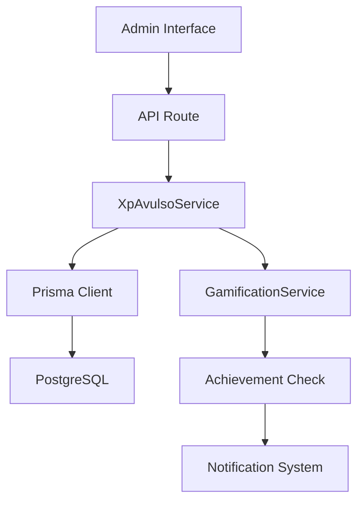

# Guia de Desenvolvimento - Sistema de XP Avulso

## Visão Geral Técnica

Este documento fornece informações técnicas detalhadas para desenvolvedores que trabalham com o sistema de XP avulso, incluindo arquitetura, padrões de código e guias de extensão.

## Arquitetura do Sistema

### Camadas da Aplicação

```
┌─────────────────────────────────────────┐
│              Frontend (React)            │
├─────────────────────────────────────────┤
│         API Routes (Next.js)            │
├─────────────────────────────────────────┤
│        Service Layer (Business)         │
├─────────────────────────────────────────┤
│         Database (Prisma + PG)          │
└─────────────────────────────────────────┘
```

### Fluxo de Dados



## Estrutura de Código

### Service Layer

#### XpAvulsoService (`src/services/xpAvulsoService.ts`)

```typescript
export class XpAvulsoService {
  // Gerenciamento de tipos de XP
  static async createXpType(data: CreateXpTypeData): Promise<XpTypeConfig> {
    // Validação de dados
    const existingType = await prisma.xpTypeConfig.findUnique({
      where: { name: data.name }
    });

    if (existingType) {
      throw new Error('Nome do tipo já existe');
    }

    // Criação do tipo
    return await prisma.xpTypeConfig.create({
      data: {
        ...data,
        active: true,
        createdAt: new Date(),
        updatedAt: new Date()
      },
      include: {
        creator: {
          select: { name: true }
        }
      }
    });
  }

  static async grantXp(data: GrantXpData): Promise<XpGrantResult> {
    return await prisma.$transaction(async (tx) => {
      // 1. Validar dados
      const [attendant, xpType, activeSeason] = await Promise.all([
        tx.attendant.findUnique({ where: { id: data.attendantId } }),
        tx.xpTypeConfig.findUnique({ where: { id: data.typeId } }),
        tx.gamificationSeason.findFirst({ where: { active: true } })
      ]);

      if (!attendant || !xpType || !activeSeason) {
        throw new Error('Dados inválidos para concessão');
      }

      // 2. Criar evento XP via GamificationService
      const xpEvent = await GamificationService.createXpEvent({
        attendantId: data.attendantId,
        points: xpType.points,
        reason: `XP Avulso: ${xpType.name}`,
        type: 'MANUAL_GRANT',
        seasonId: activeSeason.id
      });

      // 3. Registrar concessão
      const grant = await tx.xpGrant.create({
        data: {
          attendantId: data.attendantId,
          typeId: data.typeId,
          points: xpType.points,
          justification: data.justification,
          grantedBy: data.grantedBy,
          xpEventId: xpEvent.id
        },
        include: {
          attendant: { select: { name: true } },
          type: { select: { name: true, color: true } },
          granter: { select: { name: true } }
        }
      });

      // 4. Verificar conquistas
      const achievementsUnlocked = await GamificationService.checkAchievements(
        data.attendantId,
        activeSeason.id
      );

      return {
        ...grant,
        achievementsUnlocked
      };
    });
  }
}
```

### API Routes

#### Padrão de Implementação

```typescript
// src/app/api/gamification/xp-grants/route.ts
import { NextRequest, NextResponse } from 'next/server';
import { getServerSession } from 'next-auth';
import { z } from 'zod';
import { XpAvulsoService } from '@/services/xpAvulsoService';
import { authOptions } from '@/lib/auth';

// Schema de validação
const grantXpSchema = z.object({
  attendantId: z.string().min(1, "ID do atendente é obrigatório"),
  typeId: z.string().min(1, "ID do tipo é obrigatório"),
  justification: z.string().max(500, "Justificativa muito longa").optional()
});

export async function POST(request: NextRequest) {
  try {
    // 1. Autenticação
    const session = await getServerSession(authOptions);
    if (!session?.user || !['ADMIN', 'SUPERADMIN'].includes(session.user.role)) {
      return NextResponse.json({ error: 'Unauthorized' }, { status: 401 });
    }

    // 2. Validação de dados
    const body = await request.json();
    const validatedData = grantXpSchema.parse(body);

    // 3. Validações de negócio
    await XpAvulsoService.validateGrantLimits(session.user.id);

    // 4. Processar concessão
    const result = await XpAvulsoService.grantXp({
      ...validatedData,
      grantedBy: session.user.id
    });

    // 5. Log de auditoria
    console.log(`XP Grant: ${session.user.name} granted ${result.points}XP to ${result.attendant.name}`);

    return NextResponse.json({ success: true, data: result }, { status: 201 });

  } catch (error) {
    // Tratamento de erros padronizado
    return handleApiError(error);
  }
}
```

### Componentes React

#### XpGrantInterface (`src/components/gamification/XpGrantInterface.tsx`)

```typescript
'use client';

import { useState } from 'react';
import { useForm } from 'react-hook-form';
import { zodResolver } from '@hookform/resolvers/zod';
import { z } from 'zod';
import { Button } from '@/components/ui/button';
import { Form, FormControl, FormField, FormItem, FormLabel } from '@/components/ui/form';
import { Select, SelectContent, SelectItem, SelectTrigger, SelectValue } from '@/components/ui/select';
import { Textarea } from '@/components/ui/textarea';
import { useToast } from '@/hooks/use-toast';

const grantSchema = z.object({
  attendantId: z.string().min(1, "Selecione um atendente"),
  typeId: z.string().min(1, "Selecione um tipo de XP"),
  justification: z.string().max(500, "Justificativa muito longa").optional()
});

type GrantFormData = z.infer<typeof grantSchema>;

export function XpGrantInterface() {
  const [isLoading, setIsLoading] = useState(false);
  const { toast } = useToast();

  const form = useForm<GrantFormData>({
    resolver: zodResolver(grantSchema),
    defaultValues: {
      attendantId: '',
      typeId: '',
      justification: ''
    }
  });

  const onSubmit = async (data: GrantFormData) => {
    setIsLoading(true);
    try {
      const response = await fetch('/api/gamification/xp-grants', {
        method: 'POST',
        headers: { 'Content-Type': 'application/json' },
        body: JSON.stringify(data)
      });

      const result = await response.json();

      if (result.success) {
        toast({
          title: "XP concedido com sucesso!",
          description: `${result.data.points} pontos concedidos para ${result.data.attendant.name}`,
        });
        
        // Notificar conquistas desbloqueadas
        if (result.data.achievementsUnlocked?.length > 0) {
          toast({
            title: "🏆 Conquistas desbloqueadas!",
            description: `${result.data.achievementsUnlocked.length} nova(s) conquista(s)`,
          });
        }

        form.reset();
      } else {
        throw new Error(result.error);
      }
    } catch (error) {
      toast({
        title: "Erro ao conceder XP",
        description: error.message,
        variant: "destructive"
      });
    } finally {
      setIsLoading(false);
    }
  };

  return (
    <Form {...form}>
      <form onSubmit={form.handleSubmit(onSubmit)} className="space-y-6">
        {/* Campos do formulário */}
        <Button type="submit" disabled={isLoading}>
          {isLoading ? 'Concedendo...' : 'Conceder XP'}
        </Button>
      </form>
    </Form>
  );
}
```

### Hooks Customizados

#### useXpAvulsoNotifications (`src/hooks/useXpAvulsoNotifications.ts`)

```typescript
'use client';

import { useEffect, useState } from 'react';
import { useToast } from '@/hooks/use-toast';

interface XpNotification {
  id: string;
  xpAmount: number;
  typeName: string;
  justification?: string;
  levelUp?: {
    newLevel: number;
    newTitle: string;
  };
  achievementsUnlocked?: Array<{
    title: string;
    description: string;
  }>;
  timestamp: number;
  read: boolean;
}

export function useXpAvulsoNotifications(attendantId?: string) {
  const [notifications, setNotifications] = useState<XpNotification[]>([]);
  const { toast } = useToast();

  useEffect(() => {
    if (!attendantId) return;

    // Carregar notificações do localStorage
    const stored = localStorage.getItem(`xp-avulso-notifications-${attendantId}`);
    if (stored) {
      setNotifications(JSON.parse(stored));
    }

    // Listener para novos eventos
    const handleXpGranted = (event: CustomEvent) => {
      const { xpAmount, typeName, justification, levelUp, achievementsUnlocked } = event.detail;

      // Criar notificação
      const notification: XpNotification = {
        id: `xp-${Date.now()}`,
        xpAmount,
        typeName,
        justification,
        levelUp,
        achievementsUnlocked,
        timestamp: Date.now(),
        read: false
      };

      // Atualizar estado
      setNotifications(prev => {
        const updated = [notification, ...prev].slice(0, 50); // Manter apenas 50
        localStorage.setItem(`xp-avulso-notifications-${attendantId}`, JSON.stringify(updated));
        return updated;
      });

      // Mostrar toast
      toast({
        title: `🎉 +${xpAmount} XP recebido!`,
        description: `Tipo: ${typeName}${justification ? ` - ${justification}` : ''}`,
      });

      // Toast para level up
      if (levelUp) {
        toast({
          title: `🚀 Subiu de nível!`,
          description: `Agora você é ${levelUp.newTitle} (Nível ${levelUp.newLevel})`,
        });
      }

      // Toast para conquistas
      if (achievementsUnlocked?.length > 0) {
        achievementsUnlocked.forEach(achievement => {
          toast({
            title: `🏆 ${achievement.title}`,
            description: achievement.description,
          });
        });
      }
    };

    window.addEventListener('xp-avulso-granted', handleXpGranted as EventListener);

    return () => {
      window.removeEventListener('xp-avulso-granted', handleXpGranted as EventListener);
    };
  }, [attendantId, toast]);

  const markAsRead = (notificationId: string) => {
    setNotifications(prev => {
      const updated = prev.map(n => 
        n.id === notificationId ? { ...n, read: true } : n
      );
      if (attendantId) {
        localStorage.setItem(`xp-avulso-notifications-${attendantId}`, JSON.stringify(updated));
      }
      return updated;
    });
  };

  const unreadCount = notifications.filter(n => !n.read).length;

  return {
    notifications,
    unreadCount,
    markAsRead
  };
}
```

## Padrões de Desenvolvimento

### Validação de Dados

#### Schemas Zod Reutilizáveis

```typescript
// src/lib/validations/xp-avulso.ts
import { z } from 'zod';

export const xpTypeConfigSchema = z.object({
  name: z.string()
    .min(1, "Nome é obrigatório")
    .max(100, "Nome muito longo")
    .regex(/^[a-zA-ZÀ-ÿ\s]+$/, "Nome deve conter apenas letras"),
  
  description: z.string()
    .min(1, "Descrição é obrigatória")
    .max(500, "Descrição muito longa"),
  
  points: z.number()
    .int("Pontos devem ser um número inteiro")
    .min(1, "Pontos devem ser positivos")
    .max(100, "Máximo 100 pontos por tipo"),
  
  category: z.string()
    .min(1, "Categoria é obrigatória")
    .max(50, "Categoria muito longa"),
  
  icon: z.string()
    .min(1, "Ícone é obrigatório")
    .max(50, "Nome do ícone muito longo"),
  
  color: z.string()
    .regex(/^#[0-9A-F]{6}$/i, "Cor deve ser um hexadecimal válido")
});

export const grantXpSchema = z.object({
  attendantId: z.string().cuid("ID do atendente inválido"),
  typeId: z.string().cuid("ID do tipo inválido"),
  justification: z.string()
    .max(500, "Justificativa muito longa")
    .optional()
});
```

### Tratamento de Erros

#### Error Handler Centralizado

```typescript
// src/lib/error-handler.ts
import { NextResponse } from 'next/server';
import { z } from 'zod';
import { Prisma } from '@prisma/client';

export function handleApiError(error: unknown) {
  console.error('API Error:', error);

  // Erro de validação Zod
  if (error instanceof z.ZodError) {
    return NextResponse.json({
      success: false,
      error: 'Dados inválidos',
      details: error.errors.map(e => ({
        field: e.path.join('.'),
        message: e.message
      }))
    }, { status: 400 });
  }

  // Erro do Prisma
  if (error instanceof Prisma.PrismaClientKnownRequestError) {
    switch (error.code) {
      case 'P2002':
        return NextResponse.json({
          success: false,
          error: 'Dados duplicados',
          field: error.meta?.target
        }, { status: 409 });
      
      case 'P2025':
        return NextResponse.json({
          success: false,
          error: 'Recurso não encontrado'
        }, { status: 404 });
    }
  }

  // Erro de negócio
  if (error instanceof Error) {
    if (error.message.includes('Limite diário')) {
      return NextResponse.json({
        success: false,
        error: error.message
      }, { status: 429 });
    }

    if (error.message.includes('não encontrado')) {
      return NextResponse.json({
        success: false,
        error: error.message
      }, { status: 404 });
    }
  }

  // Erro genérico
  return NextResponse.json({
    success: false,
    error: 'Erro interno do servidor'
  }, { status: 500 });
}
```

### Testes

#### Estrutura de Testes

```typescript
// src/services/__tests__/xpAvulsoService.test.ts
import { describe, it, expect, beforeEach, afterEach } from '@jest/globals';
import { XpAvulsoService } from '../xpAvulsoService';
import { prisma } from '@/lib/prisma';

describe('XpAvulsoService', () => {
  let testData: {
    user: any;
    attendant: any;
    xpType: any;
    season: any;
  };

  beforeEach(async () => {
    // Setup de dados de teste
    testData = await setupTestData();
  });

  afterEach(async () => {
    // Limpeza após cada teste
    await cleanupTestData();
  });

  describe('createXpType', () => {
    it('should create XP type successfully', async () => {
      const typeData = {
        name: 'Teste XP',
        description: 'Tipo de teste',
        points: 10,
        category: 'teste',
        icon: 'star',
        color: '#FF0000',
        createdBy: testData.user.id
      };

      const result = await XpAvulsoService.createXpType(typeData);

      expect(result.name).toBe(typeData.name);
      expect(result.points).toBe(typeData.points);
      expect(result.active).toBe(true);
    });

    it('should reject duplicate names', async () => {
      const typeData = {
        name: 'Excelência no Atendimento', // Nome já existe
        description: 'Tipo duplicado',
        points: 10,
        category: 'teste',
        icon: 'star',
        color: '#FF0000',
        createdBy: testData.user.id
      };

      await expect(XpAvulsoService.createXpType(typeData))
        .rejects.toThrow('Nome do tipo já existe');
    });
  });

  describe('grantXp', () => {
    it('should grant XP successfully', async () => {
      const grantData = {
        attendantId: testData.attendant.id,
        typeId: testData.xpType.id,
        justification: 'Teste de concessão',
        grantedBy: testData.user.id
      };

      const result = await XpAvulsoService.grantXp(grantData);

      expect(result.points).toBe(testData.xpType.points);
      expect(result.attendantId).toBe(grantData.attendantId);
      expect(result.justification).toBe(grantData.justification);
    });

    it('should check achievements after granting XP', async () => {
      const grantData = {
        attendantId: testData.attendant.id,
        typeId: testData.xpType.id,
        grantedBy: testData.user.id
      };

      const result = await XpAvulsoService.grantXp(grantData);

      expect(result.achievementsUnlocked).toBeDefined();
      expect(Array.isArray(result.achievementsUnlocked)).toBe(true);
    });
  });
});

// Funções auxiliares de teste
async function setupTestData() {
  const user = await prisma.user.create({
    data: {
      name: 'Test Admin',
      email: 'test@admin.com',
      role: 'ADMIN'
    }
  });

  const attendant = await prisma.attendant.create({
    data: {
      name: 'Test Attendant',
      email: 'test@attendant.com',
      funcao: 'Atendente',
      setor: 'Teste',
      status: 'Ativo'
    }
  });

  const xpType = await prisma.xpTypeConfig.create({
    data: {
      name: 'Test XP Type',
      description: 'Tipo de teste',
      points: 10,
      category: 'teste',
      icon: 'star',
      color: '#FF0000',
      createdBy: user.id
    }
  });

  const season = await prisma.gamificationSeason.create({
    data: {
      name: 'Test Season',
      startDate: new Date('2024-01-01'),
      endDate: new Date('2024-12-31'),
      active: true,
      xpMultiplier: 1.0
    }
  });

  return { user, attendant, xpType, season };
}

async function cleanupTestData() {
  await prisma.xpGrant.deleteMany();
  await prisma.xpEvent.deleteMany();
  await prisma.xpTypeConfig.deleteMany();
  await prisma.gamificationSeason.deleteMany();
  await prisma.attendant.deleteMany();
  await prisma.user.deleteMany();
}
```

## Extensibilidade

### Adicionando Novos Tipos de XP

1. **Criar migração Prisma** (se necessário):
```sql
-- Adicionar novos campos ao XpTypeConfig
ALTER TABLE "XpTypeConfig" ADD COLUMN "metadata" JSONB;
```

2. **Atualizar schema de validação**:
```typescript
export const extendedXpTypeSchema = xpTypeConfigSchema.extend({
  metadata: z.record(z.any()).optional()
});
```

3. **Implementar lógica específica**:
```typescript
export class ExtendedXpAvulsoService extends XpAvulsoService {
  static async createSpecialXpType(data: ExtendedXpTypeData) {
    // Lógica específica para tipos especiais
    return super.createXpType({
      ...data,
      category: 'special',
      metadata: { special: true }
    });
  }
}
```

### Integrações Futuras

#### Webhook System
```typescript
// src/lib/webhooks/xp-avulso.ts
export class XpAvulsoWebhooks {
  static async notifyXpGranted(grant: XpGrant) {
    const webhookUrl = process.env.XP_WEBHOOK_URL;
    if (!webhookUrl) return;

    await fetch(webhookUrl, {
      method: 'POST',
      headers: { 'Content-Type': 'application/json' },
      body: JSON.stringify({
        event: 'xp_granted',
        data: grant,
        timestamp: new Date().toISOString()
      })
    });
  }
}
```

#### Analytics Integration
```typescript
// src/lib/analytics/xp-avulso.ts
export class XpAvulsoAnalytics {
  static trackGrantEvent(grant: XpGrant) {
    // Integração com Google Analytics, Mixpanel, etc.
    if (typeof window !== 'undefined' && window.gtag) {
      window.gtag('event', 'xp_granted', {
        event_category: 'gamification',
        event_label: grant.type.name,
        value: grant.points
      });
    }
  }
}
```

## Performance e Otimização

### Queries Otimizadas

```typescript
// Busca otimizada com includes seletivos
const grants = await prisma.xpGrant.findMany({
  where: filters,
  include: {
    attendant: {
      select: { id: true, name: true }
    },
    type: {
      select: { name: true, color: true, category: true }
    },
    granter: {
      select: { name: true }
    }
  },
  orderBy: { grantedAt: 'desc' },
  take: limit,
  skip: (page - 1) * limit
});
```

### Caching Strategy

```typescript
// src/lib/cache/xp-avulso.ts
import { Redis } from 'ioredis';

const redis = new Redis(process.env.REDIS_URL);

export class XpAvulsoCache {
  static async getActiveTypes(): Promise<XpTypeConfig[] | null> {
    const cached = await redis.get('xp-types:active');
    return cached ? JSON.parse(cached) : null;
  }

  static async setActiveTypes(types: XpTypeConfig[]) {
    await redis.setex('xp-types:active', 300, JSON.stringify(types)); // 5 min
  }

  static async invalidateTypeCache() {
    await redis.del('xp-types:active');
  }
}
```

## Monitoramento e Debugging

### Logs Estruturados

```typescript
// src/lib/logger/xp-avulso.ts
export class XpAvulsoLogger {
  static logGrant(grant: XpGrant, granter: User) {
    console.log(JSON.stringify({
      event: 'xp_granted',
      timestamp: new Date().toISOString(),
      grantId: grant.id,
      attendantId: grant.attendantId,
      typeId: grant.typeId,
      points: grant.points,
      granterId: granter.id,
      granterName: granter.name,
      justification: grant.justification
    }));
  }

  static logError(error: Error, context: Record<string, any>) {
    console.error(JSON.stringify({
      event: 'xp_error',
      timestamp: new Date().toISOString(),
      error: error.message,
      stack: error.stack,
      context
    }));
  }
}
```

### Health Checks

```typescript
// src/app/api/health/xp-avulso/route.ts
export async function GET() {
  try {
    // Verificar conexão com banco
    await prisma.xpTypeConfig.count();
    
    // Verificar tipos ativos
    const activeTypes = await prisma.xpTypeConfig.count({
      where: { active: true }
    });

    // Verificar temporada ativa
    const activeSeason = await prisma.gamificationSeason.findFirst({
      where: { active: true }
    });

    return NextResponse.json({
      status: 'healthy',
      timestamp: new Date().toISOString(),
      checks: {
        database: 'ok',
        activeTypes: activeTypes,
        activeSeason: activeSeason ? 'ok' : 'warning'
      }
    });
  } catch (error) {
    return NextResponse.json({
      status: 'unhealthy',
      error: error.message
    }, { status: 500 });
  }
}
```

Este guia fornece uma base sólida para desenvolvedores trabalharem com o sistema de XP avulso, incluindo padrões de código, testes e estratégias de extensão.